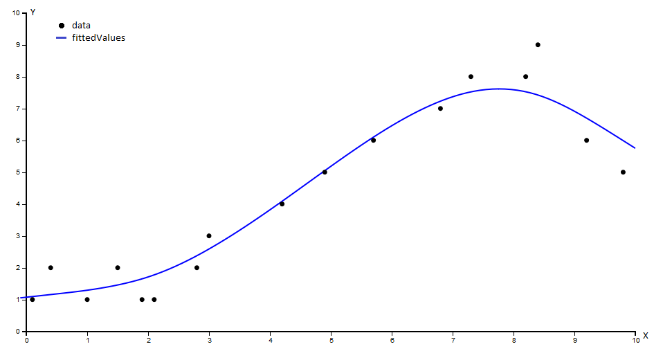

# Regression

## Summary

The Regression Object can be used to calculate an analytic approximation of a given set of value pairs. The result is a linear combination of chosen basis functions which fit the given values the best. The calculated parameters are saved within the Regression object.
The resulting function is a fit of the given value pairs. The function, its first or second derivative can be evaluated at any given position or 

## Usage

### Example
Given is a dataset with points in 2D space in the form of x-coordinates *X* and corresponding y-coordinates *Y*. The input data needs to be sorted by x-value.
As basis we choose a truncated power basis (basically cubic splines) and as regualizer for the linear regression problem the squared second derivative (sq2ndDer).

```js
var data = {
  X: [0.1,0.4,1,1.5,1.9,2.1,2.8,3,4.2,4.9,5.7,6.8,7.3,8.2,8.4,9.2,9.8],
  Y: [1,2,1,2,1,1,2,3,4,5,6,7,8,8,9,6,5]
};

var options = {
  data: data,
  basis: "trunc-power",
  regualizer: "Sq2ndDer",
  lambda: 0.1
};

var regression = new Regression(options);
regression.calcRegression();

var fittedValues = regression.sample([0,10],50);
```

Plot of the given *data* and the sampled values of the regression function *fittedValues* (done with d3.js).


### Options

- *data*: Object { X: Array, Y: Array }

    The value pairs have to be presorted by x-value from smaller to higher. The data object must contain at least two value pairs.
    
- *basis*: String
    - "trunc-power" (default)
        
        basically a cubic polynomial basis

    - "linear"

        a linear and a constant basis function

- *regualizer*: String
    - "Sq2ndDer" (default)
    - "ridge"
    - "none"
- *knots*: Array or *false* (default *false*)

    Positions for the knots for the basis functions. False will result in an automatic choose for the knots (usully the point positions itself)

- *lambda*: Number >0 (default 0.01)

    prefactor for the regualizer, works as a smoothing parameter


### All Methods
- Regression.setBasis(basisId)

    Sets the used basis for the linear regression to *basisId*.

- Regression.calcRegression(options)

    Triggers the calculation of the regression and overides the existing options with *options* (optional).

- Regression.sample(interval,resolution)

    Samples the regression function for the given *interval* with the given *resolution*. Triggers *Regression.calcRegression()* if not done yet.

- Regression.sampleDer(interval,resolution)

    Samples the 1st derivative of the regression function for the given *interval* with the given *resolution*. Triggers *Regression.calcRegression()* if not done yet.

- Regression.sample2ndDer(interval,resolution)

    Samples the 2nd derivative of the regression function for the given *interval* with the given *resolution*. Triggers *Regression.calcRegression()* if not done yet.


- Regression.eval(position)

    Evaluates the regression function at the given *position*. Triggers *Regression.calcRegression()* if not done yet.

- Regression.evalDer(postion)

    Evaluates the 1st derivative of the regression function at the given *position*. Triggers *Regression.calcRegression()* if not done yet.

- Regression.eval2ndDer(position)

    Evaluates the 2nd derivative of the regression function at the given *position*. Triggers *Regression.calcRegression()* if not done yet.

- Regression.evalIntegral(interval)

    Evaluates the definite integral of the regression function over the given *interval*. Triggers *Regression.calcRegression()* if not done yet.

- Regression.analyticString() !**experimental**!

    Returns a string which represents the analytic function given by the regression.